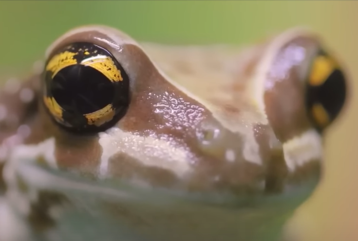

# 

## CONTACT

---

📩  [tessier.quentin.pro@gmail.com](mailto:tessier.quentin.pro@gmail.com)

🗺️  Lyon, France

## *SKILLS*

---

- C
- C++
- Vulkan
- OpenGL
- 

## SOCIALS

---

<aside>
 [@tessierquentin](https://www.linkedin.com/in/tessierquentin/)

</aside>

$$
\Huge \textbf {Quentin Tessier} \\
\small {Software\ Engineer} - {Computer\ Graphics\ Engineer}
$$

*Exploring the intersection of computer graphics, complex algorithms, and video games. When I’m not diving into the intricacies of game engine development, you can find me learning Korean or hitting the gym. Join me on this journey of code, creativity, and personal growth!*

### **PROFESSIONAL EXPERIENCE**

---

**2021 ~ 2024**

Computer Graphics Engineer | Avatar Medical

I worked for Avatar Medical has full time employee and a intern over multiple years.
I developed a volumetric raytracing engine in Unity from scratch, optimizing it for cloud execution and image streaming. This role also provided me with a deep dive into C#, enhancing my programming skills and understanding of complex system design.

**2019**

Software Engineer Intern | Airthium

During my 6-month internship at Airthium, I contributed to the open-source FreeFEM project, a multi-physics simulation software. I developed a new visualization tool from the ground up to display simulation results and integrated it with FreeFEM, enabling network transfer between the two. My work involved utilizing Vulkan for high-performance rendering, enhancing the overall user experience.

### EDUCATION

---

**2017 - 2023**

Master’s Degree in Computer Science | Epitech

GPA: 3.00

At Epitech, I engaged in diverse projects that honed my technical skills and problem-solving abilities. I tackled complex challenges in software development, collaborated on innovative solutions, and applied my knowledge to real-world scenarios.

### MY PROJECTS

---

Parsing

[https://github.com/QuentinTessier/ZigParsec](https://github.com/QuentinTessier/ZigParsec)

**ZigParsec**

Exploration of Zig to build parser combinator following Haskell Parsec library. Comes with all default combinators and an Expression parser that can create an Abstract Syntax Tree given a simple operator table. Intend to use it to build a custom shader language for Antlene.

Game Engine

[https://github.com/QuentinTessier/Antlene](https://github.com/QuentinTessier/Antlene)

**Antlene**

My current main project, heavely work in progress. Built using Zig, Vulkan, Entt and more cool tech. You can also find some of the dependencies I am building by hand with it on my github (windowing API, math API, graphic abstraction, …)